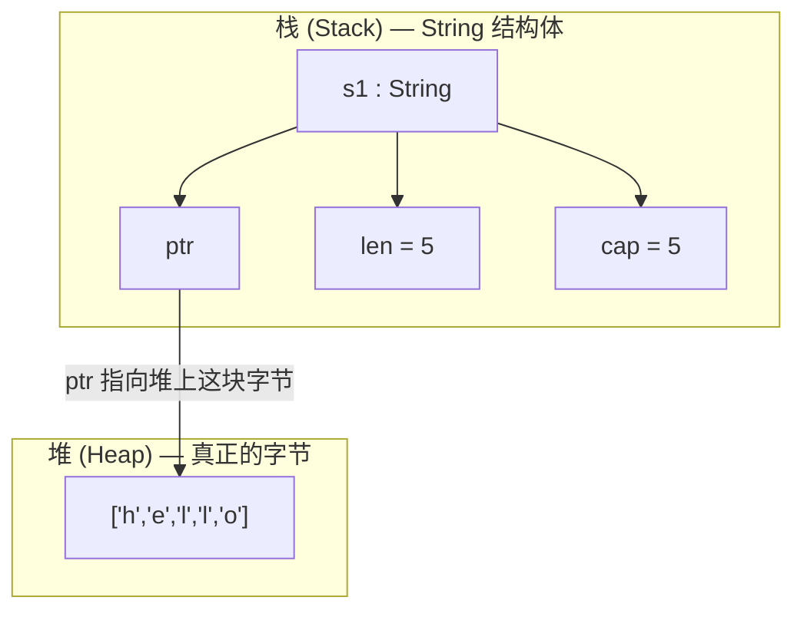
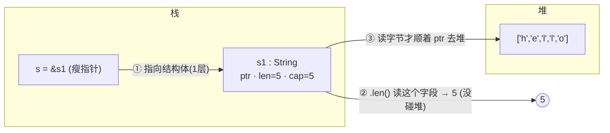
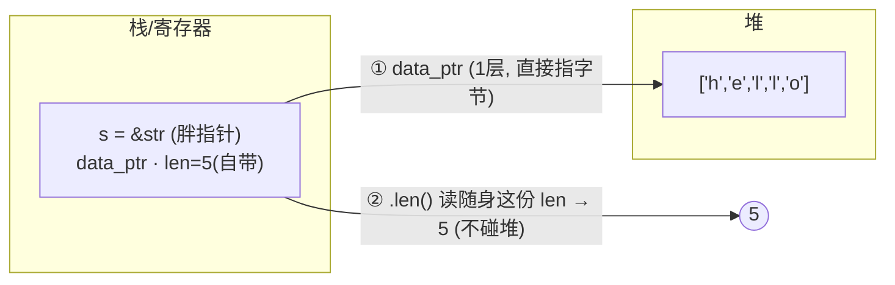
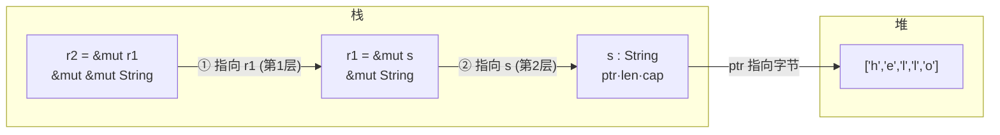

# Rust 所有权与引用（理清版）

---

## 0. 总结

- **所有权** = 编译器强制的一组契约（就是那三条规则），不是一件"东西"。
- **move** = 把东西永久送人。**borrow / 引用** = 借来看一眼，不拿走所有权。
- **`&String`**：瘦指针 → 指向栈上的 String **结构体**。
- **`&str`**：胖指针 → 直接指向堆字节，且**随身自带 len**。
- 两种都只有**一层引用**，差别只在"指针指向谁"。
- 读 `len` 两边都**不碰堆**（len 住在栈这一侧）；读字节才去堆。

---

## 1. 所有权到底是什么

我之前问 ai，它讲了"栈槽位、有效性标记、编译器插 drop"——那些是**编译器的实现方式**，不是**概念本身**。我追问"所有权是什么"，它没正面答，因为它其实没有更深的实体。

**所有权就是那三条规则本身**，跟"单人房 = 一个房间只能住一个人、退房要打扫"是一回事，不存在一个叫"所有权"的东西在后面撑着。

```rust
// 规则 1：Rust 中的每一个值都有一个所有者
// 规则 2：值在任一时刻有且只有一个所有者
// 规则 3：当所有者离开作用域的时候，这个值将被丢弃
```

**核心只有一个：这块堆内存，谁来负责清理？** 编译器保证它恰好有一个负责人，清理恰好一次。引用不参与这个责任——它只是临时借看。

---

## 2. String 的内存布局

`String` 这个"值"分布在两处：**栈**上放结构体（ptr/len/cap），**堆**上放真正的字符字节。



### ptr / len / cap 分别是什么

- **ptr**：指向堆上那块字节的地址。
- **len**：当前**实际使用的**字节数（用掉了多少）。
- **capacity**：堆上**为你预留的**容量（占了多少地皮）。

### capacity 和 len 为啥不一样

现在看相等（都是 5），其实语义完全不同。再 push 一个字符：

```rust
let mut s = String::from("hello");
s.push('!');   // len 变 6，若 cap = 5 就装不下 → 重新分配，cap 变大，ptr 更新
```

- len = 用掉多少，capacity = 最多能塞多少不用搬家。（`capacity >= len` 永远成立）

---

## 3. move 与 clone

按规则二（唯一性），堆内存不能让两个 `String` 同时指着。

```rust
let s1 = String::from("hello");
let s2 = s1;          // move：所有权从 s1 移到 s2，s1 从此无效
```

为了性能，默认是**浅拷贝 + 移动**（move）。

想要深拷贝（真正的复制）：

```rust
let s1 = String::from("hello");
let s2 = s1.clone();  // 堆上克隆新的一份，两者都有效
```

**总结：把值赋给另一个变量时它会移动；持有堆数据的变量离开作用域时 drop，除非所有权已被移走。**

---

## 4. 引用（borrow）—— 之前最卡的部分

### 4.1 为什么叫"借用"

教程那句"`&s1` 创建一个指向值 `s1` 的引用，但并不拥有它"——用**借书**理解：

- **move**（`let s2 = s1;`）＝ 把书**永久送人**，书归别人，你再用 `s1` 就报错。
- **borrow / 引用**（`&s1`）＝ 借书**看一眼**，书还是 `s1` 的，用完还回去。

这就是为什么 `calculate_length(&s1)` 之后还能继续用 `s1`——引用**没拿走所有权**。

> 引用解决的核心问题：我不想每个函数都把堆内存搬来搬去（move），我只想借看，看完还你。
> 当然，也有可变引用
> 话说我们对一个变量创建可变引用之后，对这个新创建的再创建一下可变引用会如何？

### 4.2 `&String` vs `&str` —— 破解"双重指针"的错觉

教程写的是 `&String`，但用 `cargo clippy` 跑的时候，**clippy 的 `ptr_arg` lint** 会建议改成 `&str`。（注意：这是 clippy 的风格建议，`cargo build` 默认不报。）**两种不一样：**

| 参数类型 | `s` 是什么 | `s.len()` 从哪拿 5 | 读字节时去哪 | 层数 |
| --- | --- | --- | --- | --- |
| `&String` | 瘦指针 → 栈上的**结构体** | 读结构体里的 `len` 字段 | 读结构体里的 `ptr`，再**追到堆** | 1 层（到结构体） |
| `&str` | 胖指针 → **直接指堆字节**，自带 len | 读胖指针随身那份 `len` | 顺着 data_ptr **直接到堆** | 1 层（到字节） |

**两种都只有一层引用。** 我之前瞎猜"`a -> b -> c` 指向指针的指针"，是**错误类比**，要扔。真正的"多层"不是引用造成的，而是 **String 这个值本身就横跨栈和堆**（栈上是元数据，堆上是数据）。

### 4.3 `&String` 的 `.len()` 到底怎么读

`&String` 指向栈上的结构体。`s.len()` ＝ 解引用拿到结构体，再读里面的 `len` 字段。**这一步不碰堆**。要读字符字节才去堆。



### 4.4 `&str` 的 `.len()` 怎么读，胖指针的 len 什么时候被赋值

`&str` 是胖指针 `(data_ptr, len)`，直接指堆字节，**len 随身带**。`.len()` 读随身的 len，**不碰堆，也不回头翻结构体**。



那胖指针的 len 啥时候填上的？**在函数被调用的那一瞬间，deref coercion 发生时**：

```rust
calculate_length(&s1);   // s1: String，参数想收 &str

// 编译器等价代码（概念上）：
let temp: &str = {
    let inner: &String = &s1;
    let s: &str = inner.deref();   // 转换在这发生
    s
};
calculate_length(temp);
```

`String` 的 `Deref::deref` 大致是：

```rust
impl Deref for String {
    type Target = str;
    fn deref(&self) -> &str {
        // 把 self.ptr + self.len 打包成 &str 胖指针：
        //   ( data_ptr: self.ptr,  len: self.len )
        ...
    }
}
```

胖指针的 `len` **就是从 `s1` 结构体自己的 `len` 字段读出来、拷进去的**——发生在调用处，不是运行时被谁后来填的。

**关键**：这份 len 是**拷贝，不是引用**。函数收到胖指针后，`s.len()` 读自己兜里这份，不再回头翻 `s1`。它也是**快照**，不会过期——因为 `&str` 是不可变借用，期间没人能改 `s1` 的长度。

> 字符串字面量 `"hello"` 本身就是一个 `&'static str`，它的 len 是**编译期写死**的常量，直接烘焙进胖指针里，连结构体都不存在。

---

### 4.5 对可变引用再取可变引用（真正的双层引用）

上面强调"引用只有一层"，那是**平常 `&x` 的情况**。但你要"**引用一个引用**"时，就会真的出现两层——这就是我之前纠结的"a -> b -> c"的**真实版本**。

```rust
let mut s = String::from("hello");
let mut r1 = &mut s;      // r1: &mut String，可变借用 s
let r2 = &mut r1;         // r2: &mut &mut String，可变借用 r1（引用套引用）
```

**两个坑（嵌套引用 `&mut r1` 的坑）：**

1. **`r1` 的绑定必须带 `mut`**，否则对 `r1` 取 `&mut` 报错：

```rust
let r1 = &mut s;
let r2 = &mut r1;   // ❌ E0596: cannot borrow `r1` as mutable, as it is not declared as mutable
```

1. **`r2` 类型是 `&mut &mut String`**，要碰底层数据需**解引用两层**：

```rust
(**r2).push_str("!");   // **r2 才是 String
```

> **clippy 会提醒你**：`&mut &mut` 几乎总是想用 reborrow。实测 `cargo clippy -- -W clippy::mut_mut` 对 `let r2 = &mut r1;` 报 `help: reborrow instead: &mut *r1`（`mut_mut` 是 **allow-by-default**，普通 `cargo clippy` 不显示，得显式 `-W` 才看得到）。

内存链路此时真是"两层"：



#### 正确姿势：reborrow 重新借用

如果我只是想**穿过 `r1` 读写底层数据**，通常不该嵌套引用，而该 **reborrow**：

```rust
let mut s = String::from("hello");
let r1 = &mut s;          // r1 不用声明 mut
let r2 = &mut *r1;        // reborrow：r2: &mut String（借用穿过 r1，但不吃掉 r1）
r2.push_str("!");
println!("{s}");          // hello!
```

`&mut r1` 和 `&mut *r1` 的区别：

| 写法 | `r2` 类型 | `r1` 需要 mut？ | clippy |
| --- | --- | --- | --- |
| `&mut r1` | `&mut &mut String` | 需要 | `mut_mut` 建议改 reborrow |
| `&mut *r1` | `&mut String` | **不需要** | 干净 |

**记法**：想"借到数据"用 `&mut *r1`（reborrow）；真要有意造"引用套引用"才用 `&mut r1`（clippy 会提醒）。

**能做什么 / 不能做什么（都实测过）：**

- **能改数据**：`(**r2).push_str("!")` 改的是堆上那个字符串。
- **能改 `r1` 的指向**：`*r2 = &mut s2;` 让 `r1` 改指向 `s2`（实测 `s1=hello, s2=world`，`r1` 变为指向 `s2`）。
- **不能对同一变量 `s` 同时多个可变借用**：`let r1=&mut s; let r2=&mut s; println!("{r1} and {r2}");` → `error[E0499]: cannot borrow s as mutable more than once at a time`。
- **`&mut r1` 之所以合法**：它借的是 `r1`（另一个变量），不是再去抢 `s`，所以不冲突。

> **NLL 彩蛋（实测）**：`let r1=&mut s; println!("{r1}"); let r2=&mut s;` **不报错**——`r1` 用完后借用就释放，NLL 允许再借。真正报错只发生在 `r1` 在 `r2` 创建**之后**还被使用（如上一条）。这也是 §6 NLL 的活例子。

---

## 5. 变量还是引用？借用怎么叫

```rust
let r3 = &mut s;   // r3 是一个变量(绑定)，它存的值是一个 可变引用(&mut String)
```

- `&s`（不带 mut）→ **不可变借用 / 共享借用**，只能读。
- `&mut s` → **可变借用**，能改。

`r3` 是"一个装着可变引用的变量"，口语可直接叫它"可变借用"。

---

## 6. 为什么借用的作用域到"最后一次使用"就结束（NLL）

```rust
let r1 = &s;      // 不可变借用
let r2 = &s;      // 不可变借用
println!("{r1} and {r2}");
// ↑ r1、r2 在此之后不再使用

let r3 = &mut s;  // 为什么这里还能拿可变借用？不冲突吗？
println!("{r3}");
```

按老式思维不可变借用还在，可变借用应冲突。但 Rust 用**非词法生命周期（NLL）**：精确算出 `r1`、`r2` 只在 `println!` 那行用到，**用完那一刻借用就结束**。之后没有不可变借用，`r3` 的可变借用合法。

**为什么这么设计？内存安全 + 好写：**

- **安全**：引用铁律——同一时刻要么**一个可变借用**，要么**任意多个不可变借用**，二者不能共存。这杜绝了**数据竞争**（一个读一个改）和**悬垂引用**。
- **好写**：若用词法生命周期，只要 `r1`、`r2` 在大括号内"活着"，就永远无法可变借用，太憋屈。NLL 让借用只在真正用到时活着。

---

## 7. 为什么该用 `&str` 而不是 `&String`（ptr_arg）

`&String` 是**反模式**，理由：**通用**。

- `&str` 是"这段文字"的通用视角。函数**只读**时，应收最宽泛的切片，这样任何字符串来源（`String`、字面量、切片）都能传。
- `&String` 硬性要求调用方**必须有个 String**，哪怕手里只有 `"hello"`（`&str`），也得先建 String 才能传——既死板，还可能**多分配一份堆内存**（clippy 警告"involves a new allocation"就是这个）。

```rust
fn calculate_length(s: &str) -> usize {   // ✅ 推荐
    s.len()
}
fn main() {
    let s1 = String::from("hello");
    calculate_length(&s1);      // &String 自动转 &str
    calculate_length("hello");  // 字面量本身是 &str
}
```

**简单记法：能用 `&str` 就用 `&str`。只有确实要改内容（`&mut String`）或需要所有权时才用 `String`。**

---

## 8. 内存安全类比总结

- **所有权**：谁来负责清理（编译器强制执行）。
- **move**：永久送人，送完不能再碰。
- **borrow（& / &mut）**：借看一眼，东西还是主人的。
- **读 len**：永远读"栈这一侧的元数据"，不碰堆。
- **读字节**：顺着指针去堆。
- **唯一性/借用铁律**：杜绝双释放、悬垂指针、数据竞争。
