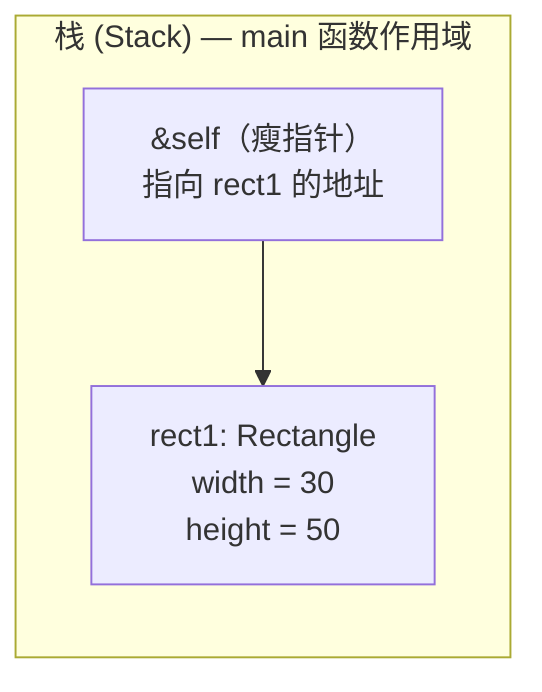
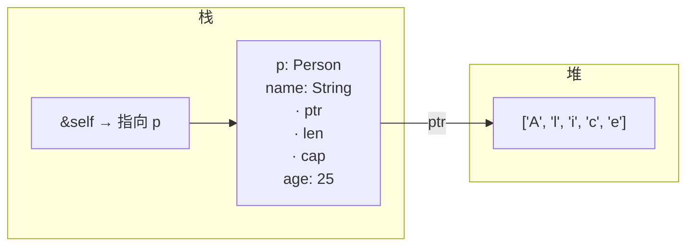
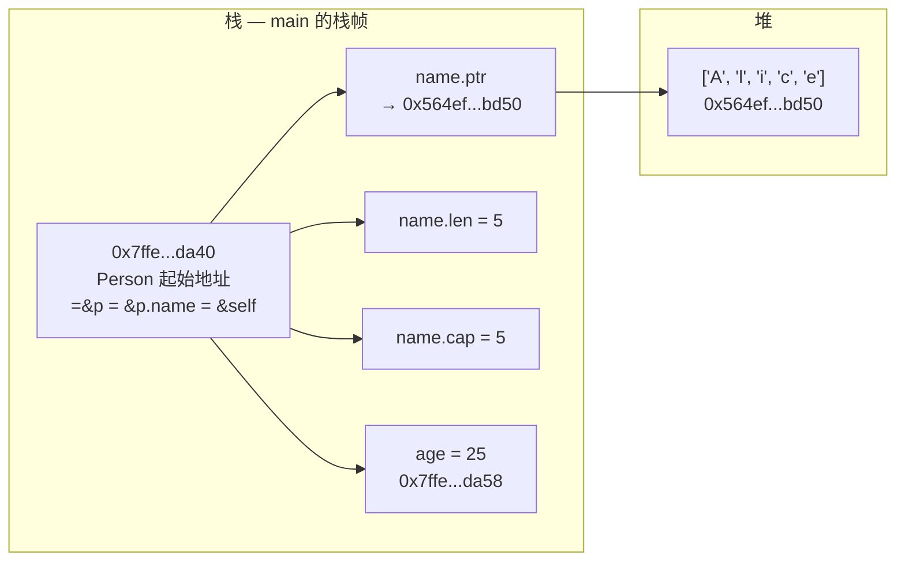
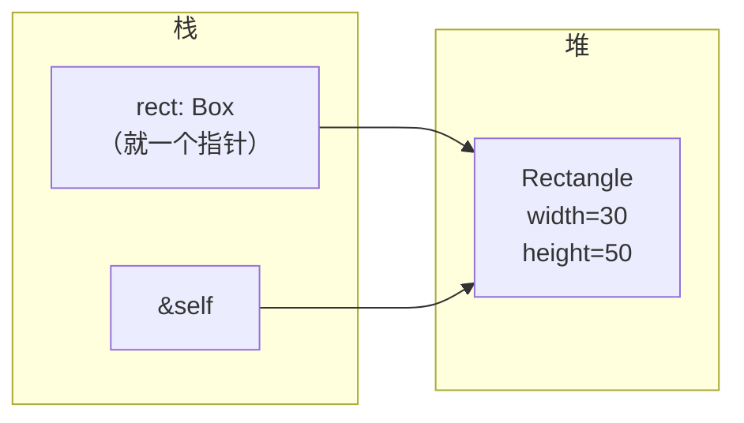

# Rust 结构体与方法中的 `self`（理清版）

---

## 0. 总结

- **`impl` 块必须挂在一个已定义的类型上**，可以是 struct、enum、trait 对象，但不能写一个根本不存在的类型。
- **方法是关联在类型上下文中的函数**，第一个参数是 `self`，普通函数没有 `self`。
- **`&self` 指向哪里 = 实例本身在哪里**。`Rectangle { width, height }` 全在栈上，`&self` 就是栈地址；如果字段里有 `Box` 或 `String`，结构体壳在栈，堆数据另算。
- **`&self` = 不可变借用**，没 `mut`、没改值，就是 borrow；想改数据用 `&mut self`，想拿走所有权用 `self`。
- **Rust 会自动帮你加 `&`**：`rect1.area()` 等价于 `Rectangle::area(&rect1)`，这是方法调用的自动引用语法糖。

---

## 1. `impl` 块——必须先有类型吗？

**`impl` 块必须对应一个已经定义好的类型**。如果你写：

```rust
struct Rectangle {
    width: u32,
    height: u32,
}

impl Rectangle {   // ✅ Rectangle 已经定义了
    fn area(&self) -> u32 { ... }
}
```

但如果写：

```rust
impl Imaginary {   // ❌ 编译报错：找不到 Imaginary
    fn foo(&self) {}
}
```

编译器会直说 `error[E0412]: cannot find type Imaginary in this scope`。

### 小拓展：impl 不一定只写一块

一个类型可以**拆成多个 `impl` 块**，编译器最后会把它们合并：

```rust
impl Rectangle {
    fn area(&self) -> u32 { self.width * self.height }
}

impl Rectangle {
    fn perimeter(&self) -> u32 { 2 * (self.width + self.height) }
}
```

这完全合法。实际项目中，有时候会把构造方法（`new`）和实用方法分开放，让代码更有条理。

另外，**跨 crate 不能给别人的类型加 inherent impl**（也就是不带 trait 的 impl）。你只能在定义该类型的那个 crate 里写 `impl MyType`。这是 Rust 的孤儿规则（orphan rules），防止两个人给同一个类型写同名方法导致冲突。

> 但你可以给**别人的类型实现别人的 trait**，或者**本地的类型实现任何 trait**——这是被允许的。

---

## 2. `self` 指向栈？

**`&self` 指向实例本身所在的位置，实例在哪它就在哪。**

### 2.1 `Rectangle` 的内存布局——纯栈居民

你的 `Rectangle` 长这样：

```rust
struct Rectangle {
    width: u32,
    height: u32,
}
```

`u32` 是定长、已知大小的类型，**整个结构体可以完整地塞进栈里**，不需要堆分配。



当调用 `rect1.area()`：

1. `rect1` 这个变量存在 `main` 的栈帧里。
2. `&self` 就是一个指针，**指向栈上 `rect1` 的那块内存**。
3. `self.width` 就是顺着这个指针读偏移量 0 的 `u32`，`self.height` 读偏移量 4——**全程在栈上操作，没碰堆**。

### 2.2 对比：`String` 在结构体里

如果结构体里塞了 `String`，情况就不同了：

```rust
struct Person {
    name: String,   // String 的壳在栈，字节在堆
    age: u32,
}
```



这里 `&self` 仍然指向**栈上的 `Person` 结构体**，但结构体内部有一个 `ptr` 指向堆。也就是说：

- `&self` 本身永远是**一层引用**，指向实例本体。
- 实例本体可能在栈（像 `Rectangle` 和 `Person` 的壳），也可能在堆（如果你用 `Box::new(Rectangle {...})`）。
- 实例本体内如果还有指针字段，那些指针才指向堆。

### 2.3 深挖：`String` 字段是 inline 的，不是指针

问：当**`Person` 里有个 `String`，那 `&self` 是指向栈上的 `Person`，还是指向堆上的字符串数据？**

**答案是：指向栈上的 `Person`。** 而且 `String` 的三个字段（`ptr`、`len`、`cap`）是直接**嵌在 `Person` 的内存里**的，不是 `Person` 存一个"指向 String 结构体的指针"。

看实测（我跑了一段代码验证）：

```rust
struct Person {
    name: String,
    age: u32,
}

let p = Person {
    name: String::from("Alice"),
    age: 25,
};
```

输出地址：

```
&p               = 0x7ffe6530da40   ← 栈地址
&p.name          = 0x7ffe6530da40   ← 和 &p 完全一样！
&p.age           = 0x7ffe6530da58   ← 栈地址，在 name 后面
p.name.as_ptr()  = 0x564ef19abd50   ← 堆地址，差距巨大
```

这说明什么？



**关键点：**

1. **`Person` 整个壳在栈上**，`&self` 就是 `Person` 的栈起始地址。
2. **`name` 字段 inline 存放**。`Person` 的内存布局里，`name` 的位置直接塞了 `String` 的 `(ptr, len, cap)` 三个字段。`&p.name` 和 `&p` 地址相同（因为 `name` 是第一个字段），这证明它不是"存一个指针再去别的地方找 String"，而是 **String 的壳就是 Person 的一部分**。
3. **只有 `name.ptr` 指向堆**。`ptr`、`len`、`cap` 这三个值本身都住在栈上（在 `Person` 的内存范围内），只有 `ptr` 那个地址指向堆里的字节数组。
4. **`self.name.len()` 不碰堆**。`len` 就在 `Person` 的栈内存里，顺着 `&self` 的偏移直接读到，和上一篇里 `&String` 的 `.len()` 原理一样。

#### 常见误区纠正

| 错误直觉 | 实际情况 |
| --- | --- |
| `Person` 存一个指针 → 指向某个地方的 `String` 结构体 | `String` 的三个字段直接 inline 在 `Person` 里 |
| `&self` 要"先找到 Person，再找到 String，再找到堆" | `&self` 直接指 `Person` 栈地址，`self.name` 只是偏移量问题 |
| `String` 做字段会让 `Person` 也分配在堆上 | `Person` 仍在栈上，除非你用 `Box<Person>` |

> 简单记：**`String` 字段 = 在父结构体里 inline 塞一个 `(ptr, len, cap)` 三元组，只有 `ptr` 指堆。**

### 2.4 怎么让结构体本身进堆？

用 `Box`：

```rust
let rect = Box::new(Rectangle { width: 30, height: 50 });
rect.area();   // &self 指向堆上的 Rectangle
```



此时 `rect` 这个变量本身还在栈上（存的是一个指针），但 `Rectangle` 实例被 `Box` 分配到了堆上。`&self` 就指向堆里的那个 `Rectangle`。

**简单判断法则**：

| 写法 | 实例本体在哪 | `&self` 指向 |
| --- | --- | --- |
| `let r = Rectangle { ... };` | 栈 | 栈 |
| `let r = Box::new(Rectangle { ... });` | 堆 | 堆 |
| `let r = String::from("hi");` | 壳在栈，字节在堆 | 栈上的 String 结构体 |

> 注意：`String` 和 `Vec` 这种“胖壳”类型，实例本体（那个三字段结构体）永远在栈/寄存器里，真正的动态数据在堆。`&self` 指向的是壳，不是堆字节。

---

## 3. `&self` 是借用吗？

是的，**`&self` 就是不可变借用**，和你写 `rectangle: &Rectangle` 完全等价。

教程里那句话再品一遍：

> `&self` 实际上是 `self: &Self` 的缩写。

拆解一下：

```rust
fn area(&self) -> u32           // 你写的
fn area(self: &Rectangle) -> u32 // 编译器眼里的等价形式
```

- 有 `&` → 借用，不拿走所有权。
- 没有 `mut` → 不可变借用，只能读，不能改。
- 函数结束后 → 借用释放，`rect1` 还能继续用。

### 小拓展：四种 `self` 参数

Rust 的方法可以拿 `self` 的四种形态：

| 写法 | 等价完整签名 | 含义 | 用完之后原变量还能用吗？ |
| --- | --- | --- | --- |
| `&self` | `self: &Self` | 不可变借用 | ✅ 能 |
| `&mut self` | `self: &mut Self` | 可变借用 | ✅ 能（但别的同时借用会冲突） |
| `self` | `self: Self` | 拿走所有权（move） | ❌ 不能，原变量失效 |
| `mut self` | `mut self: Self` | 拿走所有权 + 允许修改这个局部变量 | ❌ 不能 |

举个例子：

```rust
impl Rectangle {
    // 不可变借用——只读
    fn area(&self) -> u32 {
        self.width * self.height
    }

    // 可变借用——可以改字段
    fn scale(&mut self, factor: u32) {
        self.width *= factor;
        self.height *= factor;
    }

    // 拿走所有权——这个 Rectangle 归我了，我可以吃掉它
    fn destroy(self) {
        println!("Destroyed a {}x{} rectangle", self.width, self.height);
        // self 在这里 drop，不能再被外面使用
    }
}
```

实测：

```rust
let mut r = Rectangle { width: 10, height: 20 };
println!("{}", r.area());   // ✅ 不可变借用，用完释放
r.scale(2);                  // ✅ 可变借用，改完了释放
r.destroy();                 // ✅ 所有权被 move 进 destroy
// println!("{}", r.width);  // ❌ 编译报错：r 已经被 move
```

---

## 4. 方法调用的语法糖——自动引用

这是另一个很容易让人困惑、但理解了就很爽的点。Rust 允许你写：

```rust
rect1.area()
```

但 `area` 的签名收的是 `&self`，为什么不用写 `&rect1`？

因为 Rust 有**自动引用与自动解引用**（auto-ref / auto-deref）：

```rust
rect1.area()
// 编译器自动等价于：
Rectangle::area(&rect1)
```

如果你写 `rect1.scale(2)`，而 `scale` 收 `&mut self`，编译器自动变成：

```rust
Rectangle::scale(&mut rect1, 2)
```

前提是 `rect1` 本身声明了 `mut`。如果没 `mut`，编译器不会自动加 `&mut`，会报错。

```rust
let rect1 = Rectangle { width: 30, height: 50 };
rect1.scale(2);  // ❌ E0596: cannot borrow `rect1` as mutable, as it is not declared as `mut`
```

这和之前那篇里“`r1` 必须声明 `mut` 才能取 `&mut r1`”是同一个道理。

---

## 5. 关联函数——没有 `self` 的函数

`impl` 块里也可以写**没有 `self` 参数的函数**，叫**关联函数**（associated functions）。它们不是方法，不能用 `.` 调用，要用 `::`。

最常见的例子是构造函数：

```rust
impl Rectangle {
    // 关联函数（不是方法，因为没有 self）
    fn new(width: u32, height: u32) -> Rectangle {
        Rectangle { width, height }
    }
}

fn main() {
    let r = Rectangle::new(30, 50);  // :: 调用
    println!("{}", r.area());         // . 调用方法
}
```

- **`Rectangle::new(...)`** → 关联函数，构造一个值返回给你。
- **`r.area()`** → 方法，第一个参数是 `&self`，操作已有的实例。

> 这个设计就是 Rust “数据与行为分离”哲学的体现：`struct` 只定义数据布局，`impl` 块挂行为。不像 C++ 的 `class` 把成员变量和成员函数揉在一个大括号里，Rust 明确拆开，但用起来通过 `.` 和 `::` 区分得很清楚。

---

## 6. 类比总结

- **`impl` 块** = 给某个类型“挂”一组功能，类型必须先存在。
- **实例在哪，`&self` 就指哪**。`Rectangle` 这种纯基础类型的结构体，默认活在栈上；`Box` 可以把它搬进堆。
- **`&self`** = 借你的东西看一眼，看完了还你，东西还是你的。
- **`&mut self`** = 借你的东西改一下，改完还你。
- **`self`** = 这东西归我了，我处置完它就没了。
- **`.` 调用方法** = Rust 自动帮你加 `&` 或 `&mut`，但 `mut` 声明不能少。
- **`::` 调用关联函数** = 不操作实例，常用来当构造函数。
